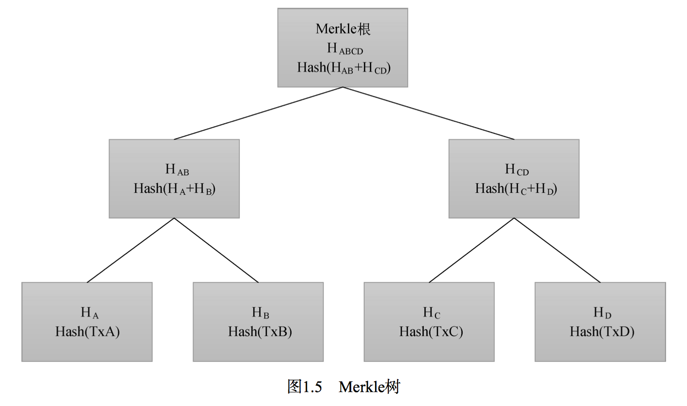

# 区块链数据结构

数据层是区块链的核心部分，区块链本质上是一种数据库技术和分布式共享账本，是由包含 交易信息的区块从后向前有序连接起来的一种数据结构。该层涉及的技术主要包括：区块结构、 Merkle树、非对称加密、时间戳、数字签名和哈希函数。时间戳和哈希函数相对比较简单，这里 重点介绍一下区块结构、Merkle树、非对称加密和数字签名。

## 区块头

每个区块一般都由区块头和区块体两部分组成。如图1.4所示，区块头部分包含了父区块哈 希值、时间戳、Merkle根等信息，而区块体部分则包含着此区块中所有的交易信息。除此之外， 每一个区块还对应着两个值来识别区块：区块头哈希值和区块高度。

每一个区块都会有一个区块头哈希值，这是一个通过SHA256算法对区块头进行二次哈希计 算而得到的32字节的数字指纹。例如，比特币的第一个区块的头哈希值为000000000019d6689c085 ae165831e934ff763ae46a2a6c172b3f1b60a8ce26f。区块头哈希值可以唯一标识一个区块链上的区 块，并且任何节点通过对区块头进行简单的哈希计算都可以得到该区块头的哈希值。区块头哈希 值并没有包含在区块的数据结构中，而是可能作为区块元数据的一部分存储在一个独立的数据库 中，以便于索引和更快地从磁盘检索区块。

除了通过头哈希值来识别区块，还可以通过区块高度来对区块进行识别。例如高度为0和前 面000000000019d6689c085ae165831e934ff763ae46a2a6c172b3f1b60a8ce26f所索引的区块都是第一 个区块。但是与头哈希值不同的是，区块高度并不能唯一地标识一个区块。由于区块链存在着分 叉情况，所以可能存在2个或以上区块的区块高度是一样的。

谈完了头哈希值和区块高度，下面介绍区块头的构造。以比特币为例，区块头是80字节，其 详细结构如表1.1所示

区块头由三组元数据组成，一组是引用父区块的哈希值数据，用于同前一区块进行相连。第 二组即难度值、时间戳和Nonce，这些都与挖矿竞争相关。第三组是Merkle根，是区块体中Merkle 树的根节点。

## 区块体-Merkle树

前面介绍了区块头哈希值、区块高度和区块头的结构，接着来看看区块体。区块体存储着交 易信息，在区块中它们是以一棵Merkle树的数据结构进行存储的，而Merkle树是一种用来有效地 总结区块中所有交易的数据结构。

### Merkle树结构

Merkle树是一棵哈希二叉树，树的每个叶子节点都是一笔交易 的哈希值。同样以比特币为例，在比特币网络中，Merkle树被用来归纳一个区块中的所有交易， 同时生成整个交易集合的数字指纹即Merkle树根，且提供了一种校验区块是否存在某交易的高效 途径。生成一棵Merkle树需要递归地对每两个哈希节点进行哈希得到一个新的哈希值，并将新的 哈希值存入Merkle树中，直到两两结合最终只有一个哈希值时，这个哈希值就是这一区块所有交 易的Merkle根，存储到上面介绍的区块头结构中。

下面通过一个实例来对Merkle树进行进一步的介绍。下图是一棵只有4笔交易的Merkle树， 即交易A、B、C和D。

### Merkle树生成过程

第一步，需要使用两次SHA256算法对每笔交易数据进行哈希运算，得到每笔交易的哈希值， 这里可以得到H A 、HB 、HC 、HD 这4个哈希值，也就是这棵Merkle树的叶子节点。

> HA = SHA256（SHA256（交易A））

第二步，对两个叶子节点HA 、HB 的哈希值同样使用两次SHA256进行组合哈希运算，
将会得到一个新的哈希值HAB，对HC、HD 进行同样的操作将获得另一个哈希值H

>HAB = SHA256（SHA256（HA ＋HB ））

第三步，对现有的两个哈希值HAB 、HCD 进行第二步中的组合运算。最后将得到一个新的哈希值HABCD ， 此时我们已经没有了其他同高度节点， 所以最后的HABCD 就是这一棵Merkle树的 Merkle根。之后将这个节点的32字节哈希值写入到区块头部Merkle根字段中。Merkle树的整个形成过程结束。